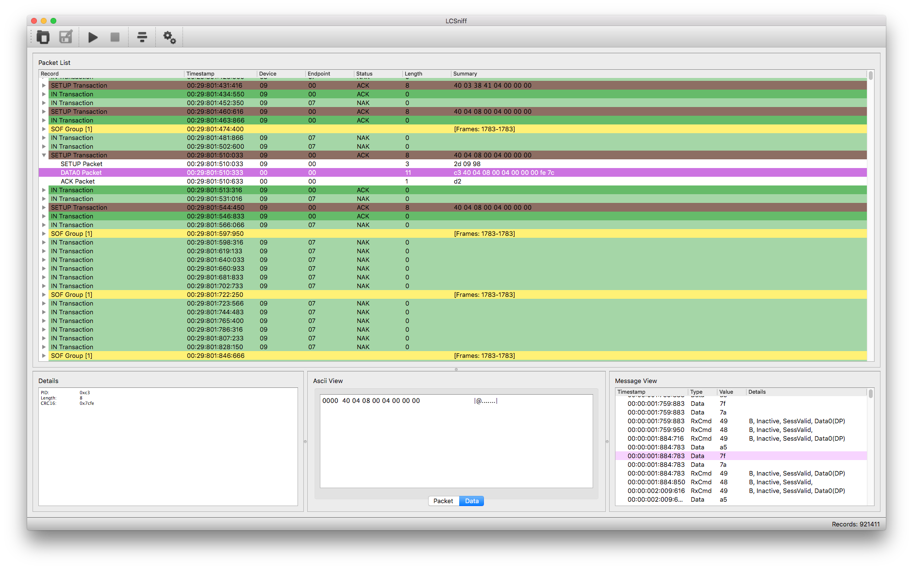

# usb2sniffer-qt

LambdaConcept lcsniff software for [USB2Sniffer hardware](http://blog.lambdaconcept.com/doku.php?id=products:usb_sniffer) ([buy](http://shop.lambdaconcept.com/home/35-usb2-sniffer.html)).



## Build instructions

### Qt Creator

Open lcsniff.pro with Qt Creator

### Linux

```
mkdir build
cd build
qmake ../lcsniff.pro
make -j
```

### macOS

```
brew install qt
mkdir build
cd build
qmake ../lcsniff.pro
make -j
```

### Windows Cross Compilation from Linux

#### Build MXE toolchain

https://mxe.cc

```
git clone https://github.com/mxe/mxe.git
cd mxe
make -j cc qt5
```

#### Install MXE or set PATH

```
export PATH=/xxx/mxe/usr/bin:$PATH
```

#### Cross compile (Static)

```
mkdir build-win
cd build-win
i686-w64-mingw32.static-qmake-qt5 ../lcsniff.pro
make -j
```
